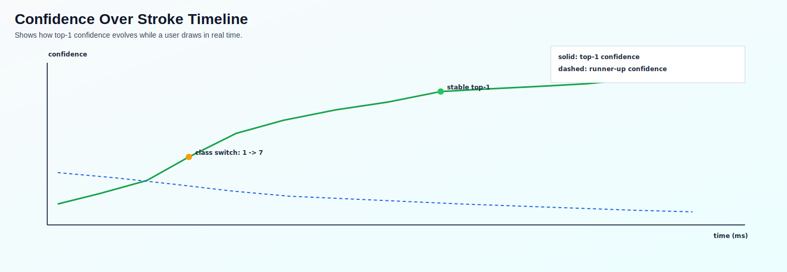

# NN

Basic neural network example using TensorFlow + Keras on the MNIST dataset.

## Setup

```bash
python3 -m venv .venv
source .venv/bin/activate
pip install -r requirements.txt
pre-commit install
```

`pre-commit install` adds the local git hook so tests/checks run before each commit.

## Run

```bash
PYTHONPATH=src python -m mnist_explorer --train
```

Or use the training script:

```bash
./train_model.sh
```

Or if your virtualenv is active:

```bash
python -m mnist_explorer --train
```

The script will:
- load and preprocess MNIST
- train a simple dense neural network
- print test loss/accuracy
- show a few sample predictions

The run command also saves the trained model to:
- `models/basic_nn_mnist.keras`

## Interactive Training UI

```bash
PYTHONPATH=src python -m mnist_explorer
```

Or use the UI launcher script:

```bash
./run_ui.sh
```

Or if your virtualenv is active:

```bash
python -m mnist_explorer
```

What the UI shows:
- input digit image (from MNIST test set)
- draw-your-own-digit canvas (white on black) for custom inference input
- Stage 1 activations: `Dense(128)`
- Stage 2 activations: `Dropout(0.2)` output in inference mode
- Stage 3 activations: `Dense(64)`
- final softmax probabilities for digits `0-9` with predicted vs true label
- top contributing neurons panel using `activation x weight`:
  - Hidden2 -> Output contributors for predicted class
  - Hidden1 -> strongest Hidden2 neuron contributors
  - Input pixel -> strongest Hidden1 neuron contributors

Notes:
- if no saved model exists, the UI trains one automatically (3 epochs) and saves it
- use dataset sample controls (or random button) to inspect known labels
- use the draw canvas for live predictions (or press `D` to run drawn input immediately)
- drawn inputs are automatically preprocessed (crop, resize, center, normalize) to better match MNIST

## Package Layout

The source code is organized by responsibility:

- `src/mnist_explorer/model/`: training + model runtime helpers
- `src/mnist_explorer/ui/`: Tk layout/rendering/preprocessing helpers
- `src/mnist_explorer/services/`: background service logic (e.g., live inference worker)
- `src/mnist_explorer/app.py`: UI controller/orchestration
- `src/mnist_explorer/__main__.py`: module entrypoint for `python -m mnist_explorer`

## Model Architecture


## Neuron-Level View


## Drawn Input Preprocessing


## Additional Explainability Visuals

### Inference Flow


### Per-sample Decision Trace


### Contribution Decomposition


### Preprocessing Before/After Grid


### Confidence Over Stroke Timeline



### Class Probability Shift Heatmap


### Layer Activation Distribution


### Neuron Saturation View


### Error Case Explainer


### Model Uncertainty Panel


### Weight Topology Snapshot


## Tests

Run unit tests:

```bash
pytest -q
```

Run all pre-commit checks manually:

```bash
pre-commit run --all-files
```

PRs to `main` are also checked automatically by GitHub Actions using this same pre-commit configuration.
